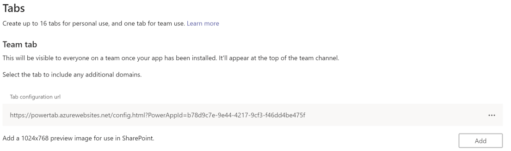
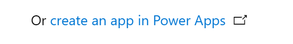

# PowerTab, (a PowerApp better integrated in a Teams Tab)

Generating a Teams app [from a PowerApp is simple](https://docs.microsoft.com/en-us/powerapps/maker/canvas-apps/embed-teams-app), right ?  
Unfortunately after adding such a `Teamsified` PowerApp to your Team and Channel, the resulting _Teams Power App_ is pretty static, and it is not aware of the Team or Channel (or Chat) it is pinned to.
And as such you may need to add additional configuration and navigation, or perhaps even create and maintain multiple copies of your PowerApp.

This can be done a little smarter, by configuring Teams to pass the relevant information as query string parameters to your Power App.
Then you can add a little logic to  read and make use of these these parameters in your PowerApp.


This can be achieved by using a custom configuration page, that takes the PowerApp Application ID, and performs the relevant configuration so that Teams will pass the relevant information to your PowerApp.
This page is only involved during the initial configuration, after this its just Teams and your PowerApp (with some additional information)   

The relevant context information includes this such as : 
* The Teams ID and Teams Display Name 
* The channel ID and Channel Display Name
* The theme (dark, light, accessible) 

## Use cases 

- Display the Teams and Channel name
- use the Theme to determine when to render a high contrast UX  
- use the Teams ID 
- Use the entity ID in a deeplink to show information regarding a specific  Mention 


## General steps :
1. Create a PowerApp
2. Save & Publish your PowerApp 
3. Download the Teams manifest for your PowerApp 
4  Import and Open the Teams App Manifest in [Teams App Studio](https://docs.microsoft.com/en-us/microsoftteams/platform/concepts/build-and-test/app-studio-overview#manifest-editor) 
3. Change the Teams app manifest to to change the configurable tab as in the below section
4. Use the PowerTab configuration page to configure which parameters you want to pass to your PowerApp
5. Retrieve the teams context parameters in PowerApp 
6. Use this Teams context in your PowerApp to drive an even better user and collaboration experience      

## Teams manifest - Team tab (a.k.a. Configurable Tab) 

You should create or change a Teams manifest to use the PowerTab config page hosted as the PoC or to your own copy.
Configuration page: `https://powertab.azurewebsites.net/config.html?PowerAppId=<ID_Of_Your_PowerApp>`

after the change it should look something like this:  


# Live PowerTab site 
for demos and Proof of concepts feel free to use the live configuration page located at:
https://powertab.azurewebsites.net/config.html

**Note: If you use the PoC page, please be aware it has limited capacity and may change or stop working with no prior notice.**
## PowerApp onStart or onLoad

In powerApp you can retrieve the teams context, and store them in global variables  using the Param function `Param("TeamId")`.
as there may be cases when the PowerApp is started outside of Teams, you can use the Coalesce function to supply a sensible default  

below is the sample form

``` PowerApp 
// get Teams context in App.OnStart
Set( glbsource, Param("source"));
Set( glbTeamId, Param("teamId"));
Set( glbChannelID, Param("channelId"));
Set( glbUPN, Param("upn") , "unknown"));
Set( glbTenantID, Param("tenantId"));

Set( glbTheme, Param("theme") , "light"));
Set( glbLoginHint, Param("loginHint"));
Set( glbTid, Param("tid"));

```
Note: The parameters names are case sensitive 

to limit the number of global variables you may choose to collect them as a single glbTeamsContext record instead. 
``` PowerApp 
// get Teams context in App.OnStart as a single  record 
Set(
    TeamsCtx,
    {
        source: Coalesce(Param("source"), "source unknown"),
        teamId: Coalesce(Param("teamId"), "0"),
        channelID: Coalesce( Param("channelId"), "Channel unknown"),
        teamName: Coalesce( Param("teamName"), "Team unknown"),
        channelName: Coalesce( Param("channelName"), "0"),
        theme: Coalesce( Param("theme"), "light")
    }
); 


```

## Easy option to create a PowerApp for embedding in Teams 

for best results : 
- Start in a Teams channel
- Add a Tab,
- Select PowerApps 
- Click the link at the bottom : `Or create an app in Power Apps` 


This will start a PowerApp that has the additional benefits of 
- A Teams Purple theme for your PowerApp 
- Automatic scaling / adjustment of the screen size

# The Details 
## All supported URL parameters 

Parameters :
 - "teamName": "The name of the current team",
 - "channelId": "The channel ID in the format 19:[id]@thread.skype",
 - "channelName": "The name of the current channel",
 - "chatId": "The chat ID in the in the format 19:[id]@thread.skype",
 - "locale": "The current locale of the user formatted as languageId-countryId (for example, en-us)",
 - "entityId": "The developer-defined unique ID for the entity this content points to",
 - "subEntityId": "The developer-defined unique ID for the sub-entity this content points to",
 - "loginHint": "A value suitable as a login hint for Azure AD. This is usually the login name of the current user, in their home tenant",
 - "userPrincipalName": "The User Principal Name of the current user, in the current tenant",
 - "userObjectId": "The Azure AD object id of the current user, in the current tenant",
 - "tid": "The Azure AD tenant ID of the current user",
 - "groupId": "Guid identifying the current O365 Group ID",
 - "theme": "The current UI theme: default | dark | contrast",
 - "isFullScreen": "Indicates whether the tab is in full-screen mode",
 - "userLicenseType": "Indicates the user licence type in the given SKU (for example, student or teacher)",
 - "tenantSKU": "Indicates the SKU category of the tenant (for example, EDU)",
 - "channelType": "microsoftTeams.ChannelType.Private | microsoftTeams.ChannelType.Regular" -->

Notes:  
- Parameter names are the same for Teams as for the PowerApp
- camelCasing may lead to mistakes, as the url string parameters are Case sensitive.


